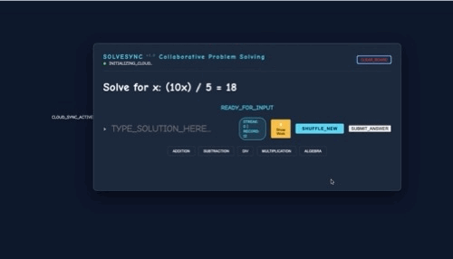

# SolveSync 🚀
A real-time math app designed to bridge the gap between algorithmic problem solving, clarity while using tts to read the solution. **From Data (Firebase) → Intelligence (AI) → Voice (TTS).**

## 👤 Author
**Jacqueline**  
[Check out my GitHub Profile](https://github.com/jdbostonbu-ops)

🚀 **[Visit SolveSync](https://jdbostonbu-ops.github.io/solvesync/)**

  

## 🌐 Compatibility & Optimization

| Browser / Device | Status | Performance Notes |
| :--- | :--- | :--- |
| **Google Chrome** | ✅ Compatible | Full support for real-time synchronization. |
| **Microsoft Edge** | ✅ Compatible | Full support for Chromium rendering. |
| **Safari** | ✅ Compatible | Full support for WebKit performance. |
| **Firefox** | ✅ Supported | Full support for UI and Algebra engine. |
| **iPad & Tablets** | ✅ Supported | Optimized for touch-based learning. |
| **iPhone (iOS)** | ⚠️ Limited | **Landscape Orientation** + **50% zoom-out** required. |

`Note: it takes TTS 34 seconds to scan the page and initiate reading.`

## 🌟 Features and Curriculum Level
- **Real-Time Sync:** Powered by Firebase Realtime Database for instant tutor-student interaction and work tracking.
- **Adaptive AI Hint Engine:** An intelligent "Show Work" system powered by Gemini-2.0-flash from [Google AI Studio](https://aistudio.google.com/). It utilizes Probabilistic Logic to generate dynamic, step-by-step solutions that scale from 3 to 10+ steps based on problem complexity.
- **🔊 AI Voice Tutoring:** Integrated Google Cloud Text-to-Speech (TTS) using high-quality Neural2 voices to read step-by-step solutions aloud, enhancing accessibility and engagement.

##  📚 Modern UI:** 
A basic app with "Slate & Cyan" engineering aesthetic with Comic Neue typography for a legible, classroom-chalkboard feel. Includes high-score persistence and visual "Success Glow" effects.
 **Multi-Level Pedagogy (AI-Guided):**
- **3rd Grade:** Place-value decomposition strategies for Addition.
- **4th Grade:** "Friendly Tutor" explanation.
- **5th Grade:** Partial Quotient methods for Division and factor-based Multiplication.
- **6th/7th Grade:** Multi-step Algebra with full equation balancing, explicitly showing inverse operations applied to BOTH sides.

## 🏆 Gamification & Rewards
- **Branchy the Math Bot**: A celebratory character that rewards students at a 3-streak.
- **Cosmo the Rocket**: A majestic, slow-burn launch sequence with screen-shake and fire-trail effects at every 5-streak.
- **Persistence Banner**: A dissolving "Star Banner" with fairy dust that rewards every 10 rounds played (correct or incorrect) to encourage long-term effort.

## 🧠 AI-Powered Hint Engine (Gemini-2.0-flash)
- **Deterministic-to-Probabilistic Logic:** SolveSync has transitioned from fixed math logic to a Probabilistic Logic Engine using Google Gemini-2.0-flash to generate solutions dynamically.
- **Multimodal Learning:** Combines visual step-by-step text with **Natural Language Audio** to cater to different learning styles.
- **Dynamic Step Expansion:** The engine scales automatically, generating anywhere from 3 to 10+ steps based on problem complexity.
- **Real-Time Reasoning:** The AI analyzes the numbers in real-time, giving students a tutoring experience to practice addition, subtraction, division, multiplication and algebra on their own.

## 🛠 Tech Stack Update
- **Frontend:** Vite, JavaScript (ES6+), CSS3
- **AI Integration:** Google Gemini API (Generative AI)
- **Backend:** Firebase Realtime Database Math Problem generator
- **Secure Config:** Environment variables (.env) for VITE_GEMINI_API_KEY to prevent credential leakage and GitHub secrets used to inject the apiKEY.

